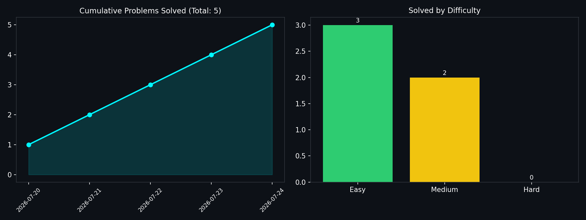

<div align="center">


<br/>


</div>

<br/>

## 🧠 About This Repository

This is my personal **LeetCode problem-solving journal** — every problem I solve, every pattern I learn, and every mistake I fix, tracked here.

> 🎯 **Goal:** Solve at least 1 problem a day, master core DSA patterns, and stay interview-ready.

Everything below — the chart, the streak, the snake — **updates itself automatically** through GitHub Actions. Solve a problem, log it, push. That's it.

<br/>

## 📊 LeetCode Stats

<div align="center">

</div>

> ⚠️ Swap `LALITH_KRISH` for your **exact** LeetCode username (check `leetcode.com/u/your-exact-id/` — no spaces allowed).

<br/>

## 📈 Auto-Visualized Daily Progress

<div align="center">

<br/>
<sub>🔄 Regenerated every day at 00:00 UTC by <code>.github/workflows/update-stats.yml</code></sub>
</div>

This chart isn't static — `scripts/generate_stats.py` reads `data/solved.json`, rebuilds a cumulative-solves + difficulty-breakdown chart, and commits it straight back to the repo. Nothing to touch by hand.

<br/>

## 🐍 Contribution Snake (Live Animation)

<div align="center">

</div>

Your GitHub contribution graph, eaten by an animated snake, regenerated daily by `.github/workflows/snake.yml`. Purely cosmetic, purely satisfying.

<br/>

## 🔥 Current Streak

<div align="center">

</div>

<br/>

## 🏆 GitHub Trophies

<div align="center">

</div>

<br/>

## 🗂️ Problems Solved

| # | Problem | Difficulty | Category | Language | Solution |
|---|---------|------------|----------|----------|----------|
| 1 | [Two Sum](https://leetcode.com/problems/two-sum/) | 🟢 Easy | Array / HashMap | Java | [Solution](./solutions/0001-two-sum/) |
| 2 | [Add Two Numbers](https://leetcode.com/problems/add-two-numbers/) | 🟡 Medium | Linked List | Java | [Solution](./solutions/0002-add-two-numbers/) |
| 20 | [Valid Parentheses](https://leetcode.com/problems/valid-parentheses/) | 🟢 Easy | Stack | Java | [Solution](./solutions/0020-valid-parentheses/) |
| 121 | [Best Time to Buy and Sell Stock](https://leetcode.com/problems/best-time-to-buy-and-sell-stock/) | 🟢 Easy | Array / DP | Java | [Solution](./solutions/0121-best-time-to-buy-and-sell-stock/) |
| 3 | [Longest Substring Without Repeating Characters](https://leetcode.com/problems/longest-substring-without-repeating-characters/) | 🟡 Medium | Sliding Window | Java | [Solution](./solutions/0003-longest-substring/) |

> 📌 Add a new row every time you solve a problem — or fold the log straight into `data/solved.json` and let the automation handle the rest.

<br/>

## 📁 Repository Structure

```
leetcode-solutions/
├── solutions/
│   ├── 0001-two-sum/
│   │   ├── Solution.java
│   │   └── notes.md
│   └── 0002-add-two-numbers/
│       ├── Solution.java
│       └── notes.md
├── data/
│   └── solved.json               # log of every problem solved (date, id, difficulty)
├── scripts/
│   └── generate_stats.py         # builds the progress chart
├── assets/
│   └── progress_chart.png        # auto-generated, don't edit by hand
├── .github/
│   └── workflows/
│       ├── update-stats.yml      # daily chart automation
│       └── snake.yml             # daily contribution-snake animation
└── README.md
```

<br/>

## 🛠️ Tech Stack

<div align="center">


</div>

<br/>

## ⚙️ How the Automation Works

1. Solve a problem → add one line to `data/solved.json`:
   ```json
   { "date": "2026-07-26", "id": 5, "title": "Longest Palindromic Substring", "difficulty": "Medium" }
   ```
2. Push (or wait — both workflows also run on a daily schedule).
3. `update-stats.yml` runs `generate_stats.py`, rebuilds `assets/progress_chart.png`, commits it back.
4. `snake.yml` regenerates the contribution snake SVG on an `output` branch and commits it back.
5. The README always reflects the **latest** state automatically.

<br/>

## 🤝 Connect

<div align="center">

[](https://github.com/Lalithkrish06)
[](https://leetcode.com/u/LALITH_KRISH/)

</div>


<div align="center">
<sub>⭐ If this repo motivates your own daily-solve journey, consider starring it!</sub>
</div>
